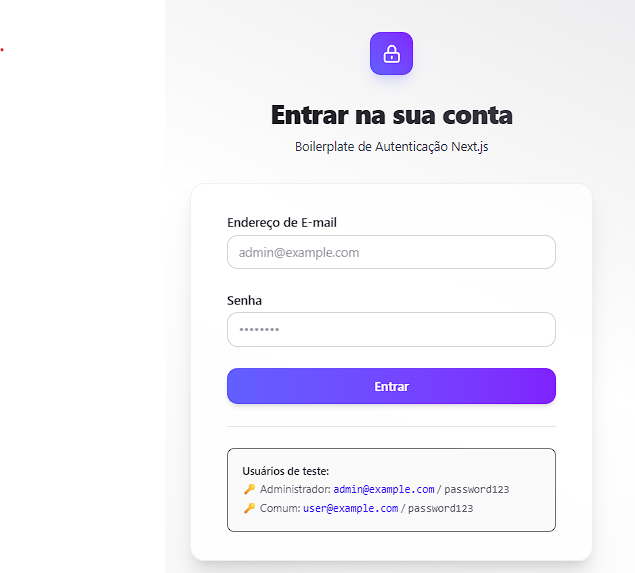

# Next.js Client-Side Auth Boilerplate

Este é um boilerplate moderno de autenticação client-side desenvolvido com **Next.js**, **React**, **Tailwind CSS** e **TypeScript**. O projeto foi estruturado para demonstrar fluxos de login, controle de sessão local (`localStorage`) e proteção de rotas privadas de forma totalmente client-side.

🌐 **Link do Projeto Publicado**: [https://rafaelsbitencourt.github.io/nextjs-with-auth-client-only/](https://rafaelsbitencourt.github.io/nextjs-with-auth-client-only/)

---

## 📸 Demonstração (Tela de Login)



---

## 🚀 Tecnologias Utilizadas

- **Core**: [Next.js](https://nextjs.org) (App Router)
- **Componentes**: [React 19](https://react.dev)
- **Estilização**: [Tailwind CSS v4](https://tailwindcss.com) (usando `@tailwindcss/postcss`)
- **Tipagem**: [TypeScript](https://www.typescriptlang.org)

---

## 🔒 Arquitetura de Autenticação

A lógica de autenticação é implementada em nível de cliente:

1. **Contexto de Autenticação (`AuthProvider`)**: 
   Definido em [auth-context.tsx](file:///c:/Users/rafae/Projetos/nextjs-with-auth-client-only/app/context/auth-context.tsx), ele mantém o estado do usuário ativo (`user`), estado de carregamento (`loading`) e funções auxiliares de `login` e `logout`. Ele lê e salva as credenciais automaticamente no `localStorage` sob a chave `auth_user`.
   
2. **Rotas Protegidas (`ProtectedRoute`)**:
   O componente wrapper [protected-route.tsx](file:///c:/Users/rafae/Projetos/nextjs-with-auth-client-only/app/components/common/protected-route.tsx) envolve páginas privadas (como a Home). Caso o usuário tente acessar uma rota protegida sem uma sessão ativa, ele é redirecionado automaticamente para `/login`.

---

## 🔑 Credenciais para Teste

O arquivo [users.ts](file:///c:/Users/rafae/Projetos/nextjs-with-auth-client-only/app/data/users.ts) contém usuários mockados para testar diferentes níveis de permissão no painel:

| Perfil | E-mail | Senha | Nome | Função (Role) |
| :--- | :--- | :--- | :--- | :--- |
| **Administrador** | `admin@example.com` | `password123` | John Doe | `admin` |
| **Usuário Comum** | `user@example.com` | `password123` | Jane Doe | `user` |

---

## 📁 Estrutura de Diretórios Relevante

```text
├── app/
│   ├── components/            # Componentes reutilizáveis divididos por contexto
│   │   ├── common/            # Componentes genéricos (como ProtectedRoute)
│   │   ├── home/              # Elementos da tela principal
│   │   └── login/             # Elementos da tela de login
│   ├── context/
│   │   └── auth-context.tsx   # Contexto React de autenticação (AuthProvider e useAuth)
│   ├── data/
│   │   └── users.ts           # Mock de usuários cadastrados
│   ├── login/
│   │   └── page.tsx           # Rota da página de login
│   ├── favicon.ico            # Ícone personalizado da aplicação
│   ├── globals.css            # Estilização global com Tailwind CSS
│   ├── layout.tsx             # Layout raiz com fontes Geist integradas
│   └── page.tsx               # Rota da página inicial (Home - Protegida)
```

---

## 🛠️ Como Executar

### 1. Instalar as Dependências

```bash
npm install
```

### 2. Rodar o Servidor de Desenvolvimento

```bash
npm run dev
```

Abra [http://localhost:3000](http://localhost:3000) no seu navegador para ver o resultado.

### 3. Build para Produção

```bash
npm run build
npm start
```
